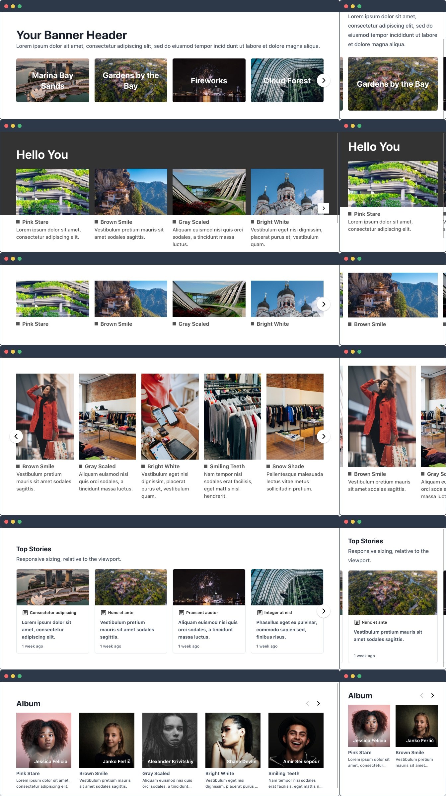

[](https://github.com/fuxingloh/vue-horizontal/actions?query=workflow%3Achrome+branch%3Amain)
[](https://github.com/fuxingloh/vue-horizontal/actions?query=workflow%3Afirefox+branch%3Amain)
[](https://github.com/fuxingloh/vue-horizontal/actions?query=workflow%3Aedge+branch%3Amain)
[](https://github.com/fuxingloh/vue-horizontal/actions?query=workflow%3ASSR+branch%3Amain)
[](https://github.com/fuxingloh/vue-horizontal/actions?query=workflow%3ASSG+branch%3Amain)
[](https://github.com/fuxingloh/vue-horizontal/blob/main/LICENSE)

# [Vue Horizontal](https://vue-horizontal.fuxing.dev) [](https://www.npmjs.com/package/vue-horizontal)

At its core, [Vue Horizontal](https://vue-horizontal.fuxing.dev) is an ultra simple pure vue horizontal layout for 
modern responsive web with zero dependencies.
Vue Horizontal is also an ultra complex code snippet dossier with over 100 SPA/SSR/SSG friendly recipes for your design needs.

#### [DEMO](https://vue-horizontal.fuxing.dev/recipes/cards) • [DOCUMENTATION](https://vue-horizontal.fuxing.dev) • [FEATURES](https://vue-horizontal.fuxing.dev/features)

[](https://vue-horizontal.fuxing.dev)


## Features and Design Philosophy

- **SSR/SSG/SPA: all modes of rendering supported**
- Mobile first for the responsive web
- Customizable navigation: scroll bar, buttons or basically everything
- UX focused, smooth scrolling, snapping for variety of use case.
- Small size of 3 KB for CDN users
- Highly extensible for any use case with [well documented recipes](https://vue-horizontal.fuxing.dev/design/principles).
  - You control how to structure your content with HTML
  - You control how it looks with CSS
  - You control how to navigate your layout with Vue.js

## Installation

```shell
npm i vue-horizontal
# or
yarn add vue-horizontal
# or via <script>
https://cdn.jsdelivr.net/npm/vue-horizontal@0.x.x/dist/vue-horizontal.esm.min.js
```

## Usage

<details>
<summary><b>Import Locally</b></summary>

```vue
<script>
import VueHorizontal from "vue-horizontal";

export default {
  components: {VueHorizontal}
}
</script>
```

</details>

<details>
<summary><b>Import Globally</b></summary>

```javascript
import Vue from 'vue';
import VueHorizontal from "vue-horizontal";

Vue.component(VueHorizontal)
```

</details>

<details>
<summary><b>Import Script</b></summary>

```html
<!-- For latest release: https://github.com/fuxingloh/vue-horizontal/releases -->
<script src="https://unpkg.com/vue-horizontal@0.6.0"></script>
```

</details>

### Using Vue Horizontal

```vue
<template>
  <vue-horizontal>
    <section v-for="item in items" :key="item.title">
      <h3>{{ item.title }}</h3>
      <p>{{ item.content }}</p>
    </section>
  </vue-horizontal>
</template>

<script>
import VueHorizontal from "vue-horizontal";

export default {
  components: {VueHorizontal},
  data() {
    return {
      // E.g: creates 20 array items...
      items: [...Array(20).keys()].map((i) => {
        return {title: `Item ${i}`, content: `🚀 Content ${i}`};
      }),
    }
  }
}
</script>

<style scoped>
section {
  padding: 16px 24px;
  background: #f5f5f5;
}
</style>
```

### [More features and examples](https://vue-horizontal.fuxing.dev/features)

- [All features demo](https://vue-horizontal.fuxing.dev/features)
- [Design: Principles](https://vue-horizontal.fuxing.dev/design/principles)
- [Design: Responsive](https://vue-horizontal.fuxing.dev/design/responsive)
- [Design: Navigation](https://vue-horizontal.fuxing.dev/design/navigation)
- [Design: Scrollbar](https://vue-horizontal.fuxing.dev/design/scrollbar)
- [Recipes](https://vue-horizontal.fuxing.dev/recipes/about)

## Known Limitations

### [CSS Scroll Behavior: Smooth](https://vue-horizontal.fuxing.dev/limitations#css-scroll-behavior-smooth)

In Vue Horizontal, smooth scrolling is enabled by default. With scroll-behavior: smooth, it enables smooth scrolling
experience when scroll event is triggered by programmatic calls. Although this is not a breaking functional feature, it
provides a "smooth" scrolling user experience.

As of December 2020, there is only a 76% cross browser compatibility (88% if you include Safari experimental feature flag).
Meantime you should polyfill this feature with more
[information provided here](https://vue-horizontal.fuxing.dev/limitations#smoothscroll-polyfill). 
Polyfill should be done by the user, there are no plans to incorporate this natively in the library.

### [CSS Scroll Snap](https://vue-horizontal.fuxing.dev/limitations#css-scroll-snap)

Scroll snap align or scroll-snapping, is a CSS technique that allows customizable scrolling experiences like pagination
of carousels by setting defined snap positions. Vue Horizontal has it enabled by default, to disable you can set 
`<vue-horizontal snap="none">`. 

As of December 2020, there is a **94%+** cross browser compatibility. 
You can choose to polyfill this, but it's more of an aesthetic feature rather than a breaking functional requirement. 

## Development

Setup, develop & test.

```shell
npm install # install
npm run serve # dev
npm run cypress:run # e2e testing
```

- End-to-end test cases are also written because of the UI nature of this framework.
  [Cypress](https://www.cypress.io/) is used under the hood.
- There are also additional integration testing done to ensure SSR and SSG works.

## Contributions

- For any question or feature request please feel free to create
  an [issue](https://github.com/fuxingloh/vue-horizontal/issues/new)
  or [pull request](https://github.com/fuxingloh/vue-horizontal/pulls).
- For feature request, do check out the examples as some of them might have been implemented.

## Prior art

- [Motivation](https://vue-horizontal.fuxing.dev/#motivation)
- [vue-horizontal-list](https://github.com/fuxingloh/vue-horizontal-list)
- [kenwheeler/slick](https://github.com/kenwheeler/slick)

Originally, this project started out as another project
called [vue-horizontal-list](https://github.com/fuxingloh/vue-horizontal-list). I created the origin project because I
liked how AirBnb does their horizontal layout. I couldn't find a library that implements it vue natively without relying
on a legacy js/jquery dependency.

This project is another take on it with an ultra simple implementation that is extensible and moves the responsibility
to the user rather than the library.
